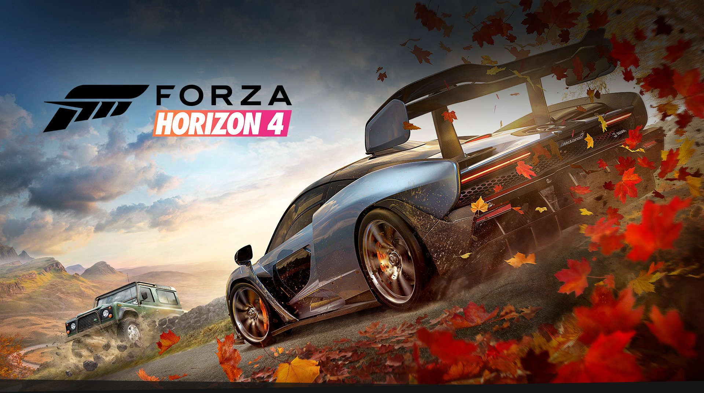

### FORZA HORIZON 4

**Game Title:** Forza Horizon 4 

# Summary 

I never played racing games until FH4. At first, I was just checking it out because it was part of the PC Game Pass. However, before long, I found myself spending hours in the game. 

# What I liked about this game

It's hard to list down all the things I find fascinating about this game. Maybe the first thing that caught my attention was the graphics - the realistic cars, and even though it's not a simulation, the implementation of the car physics is very impressive. 

My favorite part about it is probably cross country racing because I am good at it. But some days, it's almost therapeutic to just drive. 

# What I don't like about this game

Since this game is on the Microsoft Store, bugs are probably expected - bugs in the store, not the game. I lost my progress once because, as Microsoft puts it, "The profile you are trying to access no longer exists." And hours of searching the internet and debugging did not help me. I have also had to reset this game more than once - which doesn't seem like such a big deal until you realize it's 80GB. 