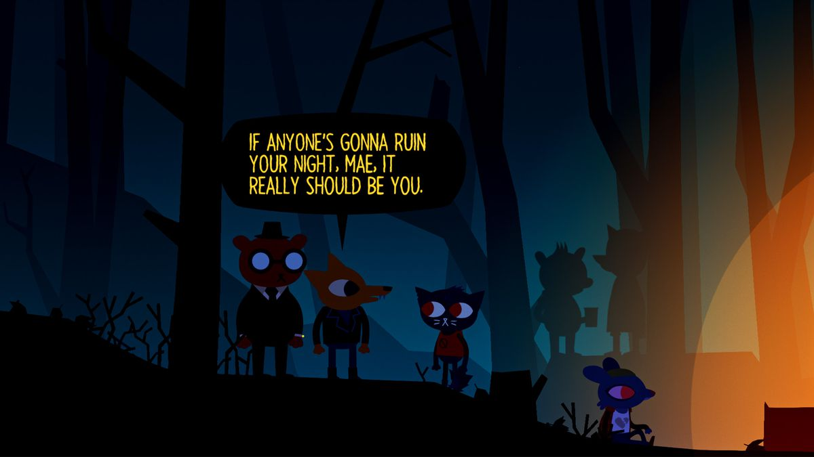

### NIGHT IN THE WOODS

**Game Title:** Night In The Woods

# Summary 

This is a narrative-driven adventure game about Mae's adventures that lead her to uncovering a horrible secret about her town. In this game, you interact a lot with Mae's friends, Gregg, Bae and Angus, and to a small extent her parents and other townspeople.  

# What I liked about this game

I really liked the mini games, especially playing the bass guitar. There aren't too many songs but it's fun to practice. 

In the game, every day starts and ends. You have the day time adventures which include Mae meeting with her friends for pizza, band practice, etc and later, the adventures in the woods. You also have the night events which start out as a form of dreams. 

The mechanics in this game are generally simple. Some of the tasks/missions introduce very new mechanics but they feel natural. 

# What I don't like about this game

When you finish the game, none of your progress gets saved. Which was disappointing because I wanted to go back and play the bass guitar and also finish that game on Mae's laptop. 