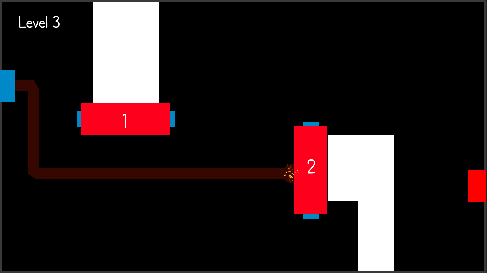

### HACK

**Theme:** Hack

**Game Title:** Hack 

**Platform:** PC 

**Controls:** Mouse  

**Download Link:** https://nextbranch.itch.io/hack

# Details 
Overall, this week has been an improvement. We think this is a good idea for a mobile game and we would like to expand it after Two Halves. 

# What went well?
We had the idea and the levels nailed down on the first day. 
Implementation of this game was fun - there was a bit to learn.

# What went wrong?
Development took longer than planned because complexity of implementation was underestimated. 

The game does not have audio 

