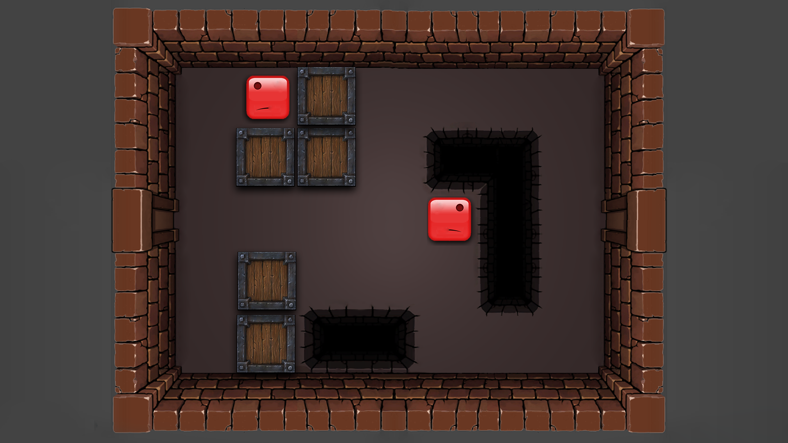

### TWO HALVES

**Theme:** Repair

**Game Title:** Two Halves 

**Description:** Move the two pieces until they're joined together to rekindle their love. The pieces move at the same time in the same direction.

**Platform:** PC 

**Controls:** Arrow Keys  

**Trailer:** https://bit.ly/2YubAbY

# Summary 

This is the first game on this journey - 52 games in 52 weeks. We used GGJ’s theme, Repair, to brainstorm ideas. 

# What went well

We were able to come up with  a good idea pretty fast. We predicted that the level design was going to be complicated but the gameplay implementation for it would be fairly simple. 
Titan’s Level Design skills were excellent!

# What went wrong 

Being the first game we created together (the two of us alone), it took a while to create an understanding of how we work. It will take a few more projects for us to learn to work together.

# Updates Feb 16, 2020.

- Alpha recorded gameplay video for Two Halves (Week 01)
- Alpha designed one level for Two Halves

