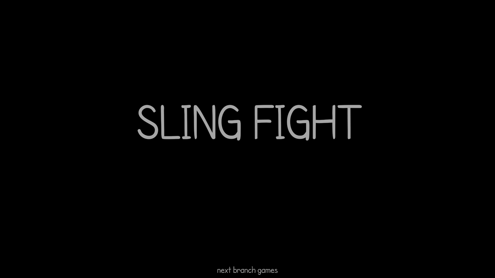

### SLING FIGHT

**Theme:** Flop

**Game Title:** Sling & Score 

**Details:** Sling Fight is the basically the original Angry Birds with two players – one on each side of the screen. It’s a turn-based same-device multiplayer.

**Platform:** PC 

**Controls:** Mouse  

**Download Link:** https://nextbranch.itch.io/sling-fight

# Details 
What can I say! This is Week 05. It went better than last week for sure. 

# What went well?
More development time went into this game than any other – which is good.

# What went wrong?
Development started late – which affected delayed completion. But the time in between was well utilized. 

