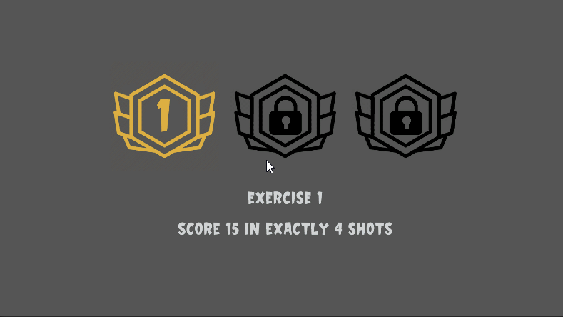

### SLING & SCORE

**Theme:** None

**Game Title:** Sling & Score 

**Details:** Sticky balls are projected onto a score board. Each slice on the board has a number assigned to it. players have to hit the required numbers to come up with a sum.

**Platform:** PC 

**Controls:** Mouse & Keyboard  

# Summary 

Titan came up with the idea for the game. He also created the 3D models. Alpha helped with the scoring system, materials and UI Design.

# What’s not going well 
- Idea generation is slow
- till don’t have sound
- Game has only one level

# What went well
- Alpha designed the UI.
- Alpha tested the game and liked it.
- Titan spent several hours learning how to make models with Blender. He managed to come up with textures and models for this game.

# What needs to change 
- Put more thought into the game ideas 
- Make games with longer play time
- Spend more time working on the games

